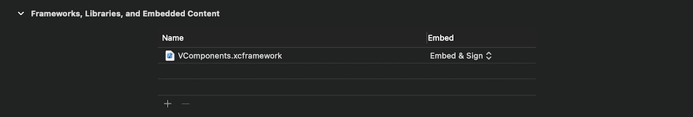

# Vakho's Components (VComponents)

## Table of Contents
- [Description](#description)
- [Demo](#demo)
- [Installation](#installation)
- [Components](#components)
- [Contact](#contact)
- [Copyright](#copyright)

## Description
VComponents is a SwiftUI framework that contains 40+ customizable UI components.

Framework supports iOS 14.0 and up. Project is being developed on macOS 11.0 Big Sur in XCode 12.

## Demo
Project contains demo app, which can be run to showcase all components. Demos for each component contain most important settings that showcase a component.

## Installation
Framework doesn't support Swift Package Manager, CocoaPods, or Carthage, and needs to be installed manually.

1. Download [VComponents](https://github.com/VakhoKontridze/files/blob/main/VComponents.framework.zip?raw=true) and extract the zip.

2. Drag `VComponents.framework` into your project.

Make sure "Copy items if needed" is selected and click Finish.

3. Go to the target settings for your app, under "General" tab, and find "Frameworks, Libraries, and Embedded Content". Set the VComponents.framework to “Embed & Sign”.

## Components

**Buttons.** VPrimaryButton, VSecondaryButton, VSquareButton, VPlainButton, VChevronButton, VCloseButton, VNavigationLink, VLink

**State Pickers.** VToggle, VCheckBox, VRadioButton

**Item Pickers.** VSegmentedPicker, VMenuPicker, VWheelPicker

**Value Pickers.** VStepper, VSlider, VRangeSlider

**Inputs.** VTextField

**Containers.** VSheet, VSection, VTable, VAccordion

**Navigation.** VTabNavigationView, VNavigationView

**Modals.** VModal, VHalfModal, VSideBar, VDialog, VMenu, VActionSheet

**Messages.** VToast

**Indicators.** VSpinner, VProgressBar, VPageIndicator

**Core.** VText, VBaseButton, VBaseTextField, VLazyList, VBaseList, VBaseView

## Contact
e-mail: [vakho.kontridze@gmail.com](mailto:vakho.kontridze@gmail.com)

## Copyright
MIT License

Copyright (c) 2020 Vakhtang Kontridze

Permission is hereby granted, free of charge, to any person obtaining a copy
of this software and associated documentation files (the "Software"), to deal
in the Software without restriction, including without limitation the rights
to use, copy, modify, merge, publish, distribute, sublicense, and/or sell
copies of the Software, and to permit persons to whom the Software is
furnished to do so, subject to the following conditions:

The above copyright notice and this permission notice shall be included in all
copies or substantial portions of the Software.

THE SOFTWARE IS PROVIDED "AS IS", WITHOUT WARRANTY OF ANY KIND, EXPRESS OR
IMPLIED, INCLUDING BUT NOT LIMITED TO THE WARRANTIES OF MERCHANTABILITY,
FITNESS FOR A PARTICULAR PURPOSE AND NONINFRINGEMENT. IN NO EVENT SHALL THE
AUTHORS OR COPYRIGHT HOLDERS BE LIABLE FOR ANY CLAIM, DAMAGES OR OTHER
LIABILITY, WHETHER IN AN ACTION OF CONTRACT, TORT OR OTHERWISE, ARISING FROM,
OUT OF OR IN CONNECTION WITH THE SOFTWARE OR THE USE OR OTHER DEALINGS IN THE
SOFTWARE.
