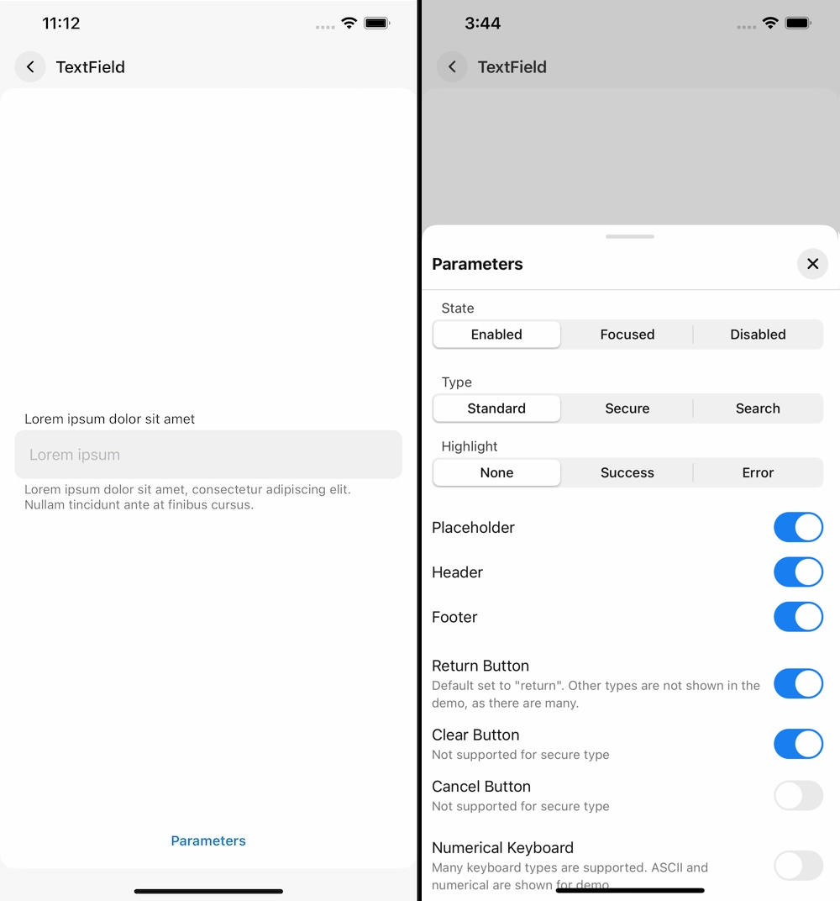

# Vakho's Components (VComponents)

## Table of Contents

- [Description](#description)
- [Demo](#demo)
- [Installation](#installation)
- [Components](#components)
- [Guidelines](#guidelines)
- [Versioning](#versioning)
- [Contact](#contact)

## Description

VComponents is a SwiftUI framework that contains 40+ customizable UI components.

Framework supports iOS 14.0 and up.

Project is being developed on macOS 11.0 Big Sur in XCode 12.

## Demo

Project contains demo app, that can be run to showcase all components.



## Installation

Framework doesn't support CocoaPods or Carthage.

### Swift Package Manager

Add `https://github.com/VakhoKontridze/VComponents` as a Swift Package in Xcode and follow the instructions.


### Manual

1. Download [VComponents.xcframework](https://github.com/VakhoKontridze/VComponents/releases/download/1.2.1/VComponents.xcframework.zip).

2. Extract the zip.

3. Drag  `VComponents.xcframework` into your project.


4. Select "Copy items if needed" and click Finish.


5. Go to the target settings for your app, under "General" tab, find "Frameworks, Libraries, and Embedded Content". Set the `VComponents.xcframework` to “Embed & Sign”.


### Building Your Own Target

Since VComponents is open-source, you can clone the project and build the framework target yourself.

## Components

**Buttons.** VBaseButton, VPrimaryButton, VSecondaryButton, VSquareButton, VPlainButton, VChevronButton, VCloseButton, VNavigationLink, VLink

**State Pickers.** VToggle, VCheckBox, VRadioButton

**Item Pickers.** VSegmentedPicker, VMenuPicker, VWheelPicker

**Value Pickers.** VStepper, VSlider, VRangeSlider

**Inputs.** VBaseTextField, VTextField

**Lists** VBaseList, VList, VSectionList, VAccordion

**Navigation.** VTabNavigationView, VNavigationView

**Modals.** VModal, VHalfModal, VSideBar, VDialog, VMenu, VActionSheet

**Messages.** VToast

**Indicators.** VSpinner, VProgressBar, VPageIndicator

**Misc.** VText, VSheet, VLazyScrollView, VBaseView

## Guidelines

### Models

Components are not meant to be customized like you would a native SwiftUI component.

Instead, model can be passed as parameter to initializers. This parameter has default value, and is not required every time you create a view.

Models are structs with default values. They break down into 5 sub-structs: `Layout`, `Colors`, `Fonts`, `Animations`, and `Misc`.

For instance, changing foreground color of `VSecondaryButton` can be achieved by passing a custom model.

**Not Preferred**:

```swift
var body: some View {
    VSecondaryButton(
        action: { print("Pressed") },
        title: "Lorem ipsum"
    )
        .foregroundColor(.black)
}
```

**Preferred**:

```swift
let model: VSecondaryButtonModel = {
    var model: VSecondaryButtonModel = .init()
    
    model.colors.textContent = .init(
        enabled: .black,
        pressed: .gray,
        disabled: .gray
    )
    
    return model
}()

var body: some View {
    VSecondaryButton(
        model: model,
        action: { print("Pressed") },
        title: "Lorem ipsum"
    )
}
```

Alternately, you can create static instances of models for reusability.

```swift
var body: some View {
    VSecondaryButton(
        model: .myCustomModel,
        action: { print("Pressed") },
        title: "Lorem ipsum"
    )
}

extension VSecondaryButtonModel {
    static let myCustomModel: VSecondaryButtonModel = {
        var model: VSecondaryButtonModel = .init()
        
        model.colors.textContent = .init(
            enabled: .black,
            pressed: .gray,
            disabled: .gray
        )
        
        return model
    }()
}
```

### Types

Some components take type as parameter. Types are represented as enums, as more can be added in the future.

For instance, `VPageIndicator` has three types: `Finite`, `Infinite`, and `Auto`. Unlike models, types may be required in some instances. For other enums, a default case is provided.

```swift
var body: some View {
    VStack(content: {
        VPageIndicator(type: .finite, total: 9, selectedIndex: 4)
        
        VPageIndicator(type: .infinite(), total: 99, selectedIndex: 4)
        
        VPageIndicator(type: .auto(), total: 99, selectedIndex: 4)
    })
}
```

### States

States in components are represented as enums. They can be passed as a parameter to initializers, must most default to `enabled`.

Some enums contain case `disabled`, which is preffered over  `SwiftUI`'s `.disabled()` modifier.
`.disabled()` modifier changes color and opacity of a native `Button`, but this behavior is limited in nature.
Some components in this framework contain multiple subviews, which require a more in-depth customization.
For instance, we can customize `VSecondaryButton`'s foreground, background, and border colors separately for `enabled`, `pressed`, and `disabled` states.
Also keep in mind, that using a native modifier instead of state property may cause unintended side-effects.

**Not Preferred**:

```swift
var body: some View {
    VSecondaryButton(
        action: doSomething,
        title: "Press"
    )
        .disabled(true)
}
```

**Preferred**:

```swift
var body: some View {
    VSecondaryButton(
        state: .disabled,
        action: doSomething,
        title: "Press"
    )
}
```

Some enums can also contain additional cases, such as `focused` for `VBaseTextField` and `VTextField`.

### Animations

VComponents approaches animations as bound to components and their models, and not to state. Which means, that to modify a state of component with an animation, you need to pass a custom model.

**Not Preferred**:

```swift
@State var isOn: Bool = false

var body: some View {
    VStack(content: {
        VToggle(isOn: $isOn, title: "Lorem ipsum")
        
        VSecondaryButton(
            action: { withAnimation(nil, { isOn.toggle() }) },
            title: "Toggle"
        )
    })
}
```

**Preferred**:

```swift
@State var isOn: Bool = false

let model: VToggleModel = {
    var model: VToggleModel = .init()
    model.animations.stateChange = nil
    return model
}()

var body: some View {
    VStack(content: {
        VToggle(model: model, isOn: $isOn, title: "Lorem ipsum")
        
        VSecondaryButton(
            action: { isOn.toggle() },
            title: "Toggle"
        )
    })
}
```

First method is not only not preferred, but it will also not work. Despite specifying `nil` to change state, `VToggle` would still use its default animation.

Components manage state parameters internally, and animations used to change them externally do not have any effect.

Thought process behind his design choice was to centralize animations to model.

Components also prevent themselves from modifying external state with an animation.

## Versioning

*Major*. Major changes, such as new component or type

*Minor*. Minor changes, such as new properties in models

*Patch*. Bug fixes and improvements

## Contact

e-mail: [vakho.kontridze@gmail.com](mailto:vakho.kontridze@gmail.com)
